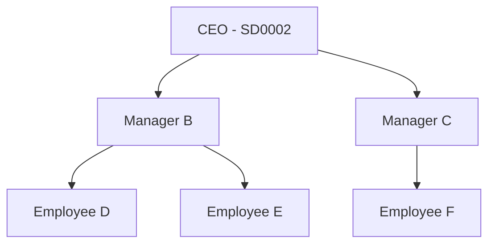

# SQL Recursive Queries for Employee Hierarchies

> A complete guide to building and querying organizational hierarchies using recursive CTEs

---

## 📋 Table of Contents

- [[#overview|Overview]]
- [[#hierarchy-basics|Hierarchy Basics]]
- [[#recursive-cte-fundamentals|Recursive CTE Fundamentals]]
- [[#query-anatomy|Query Anatomy]]
- [[#execution-flow|Execution Flow]]
- [[#materialized-paths|Materialized Paths]]
- [[#java-implementation|Java Implementation]]
- [[#best-practices|Best Practices]]

---

## 🎯 Overview

**Recursive Common Table Expressions (CTEs)** allow you to traverse hierarchical data structures like employee-manager relationships. This technique is essential for:

- Building organizational charts
- Finding all reports under a manager
- Creating navigation breadcrumbs
- Processing tree-structured data

---

## 🌳 Hierarchy Basics

### Visual Structure



### Database Storage (Adjacency List)

| employee_id | reporting_manager_id | name       |
|-------------|---------------------|------------|
| SD0002      | NULL                | CEO        |
| B           | SD0002              | Manager B  |
| C           | SD0002              | Manager C  |
| D           | B                   | Employee D |
| E           | B                   | Employee E |
| F           | C                   | Employee F |

> 💡 **Key Insight**: Each employee stores a reference to their manager (parent node)

---

## 🔄 Recursive CTE Fundamentals

### Structure

```sql
WITH RECURSIVE cte_name AS (
    -- 🏁 ANCHOR MEMBER (Base Case)
    SELECT columns
    FROM table
    WHERE starting_condition
    
    UNION ALL
    
    -- 🔁 RECURSIVE MEMBER
    SELECT columns
    FROM table
    JOIN cte_name ON join_condition
)
SELECT * FROM cte_name;
```

### Key Components

| Component | Purpose | Example |
|-----------|---------|---------|
| **Anchor Member** | Starting point of recursion | Find root employee |
| **Recursive Member** | Self-referencing query | Find direct reports |
| **UNION ALL** | Combines results | Builds complete hierarchy |
| **Join Condition** | Links parent to children | `e.manager_id = cte.employee_id` |

---

## 🔍 Query Anatomy

### Complete Working Query

```sql
WITH RECURSIVE sub_tree AS (
    -- 🏁 BASE CASE: Find the root employee
    SELECT 
        e.employee_id,
        e.reporting_manager_id,
        1 AS level  -- Root is level 1
    FROM efamily.efamily_emp_reporting_managers e
    LEFT JOIN econnect.user_details ud ON e.employee_id = ud.user_id
    WHERE e.employee_id = 'SD0002' AND ud.status = true
 
    UNION ALL
 
    -- 🔁 RECURSIVE CASE: Find direct reports
    SELECT 
        e.employee_id,
        e.reporting_manager_id,
        st.level + 1  -- Increment depth
    FROM efamily.efamily_emp_reporting_managers e
    LEFT JOIN econnect.user_details ud ON e.employee_id = ud.user_id
    INNER JOIN sub_tree st ON e.reporting_manager_id = st.employee_id
    WHERE ud.status = true
)
-- 📊 FINAL SELECT: Enrich with employee details
SELECT 
    st.employee_id,
    emp.fullname AS employee_name,
    emp.employee_img,
    st.reporting_manager_id,
    mgr.fullname AS manager_name,
    st.level
FROM sub_tree st
LEFT JOIN econnect.mv_master_employee_details emp ON st.employee_id = emp.employee_id
LEFT JOIN econnect.mv_master_employee_details mgr ON st.reporting_manager_id = mgr.employee_id
ORDER BY st.level;
```

### Breakdown by Section

#### 🏁 Anchor Member
```sql
SELECT e.employee_id, e.reporting_manager_id, 1 AS level
FROM efamily_emp_reporting_managers e
WHERE e.employee_id = 'SD0002'
```
- **Purpose**: Find the starting employee (root of hierarchy)
- **Output**: Single row with the CEO/manager you want to start from
- **Level**: Always 1 for root

#### 🔁 Recursive Member  
```sql
SELECT e.employee_id, e.reporting_manager_id, st.level + 1
FROM efamily_emp_reporting_managers e
INNER JOIN sub_tree st ON e.reporting_manager_id = st.employee_id
```
- **Purpose**: Find employees who report to someone already in `sub_tree`
- **Key Join**: `e.reporting_manager_id = st.employee_id`
- **Level**: Incremented for each generation

---

## ⚡ Execution Flow

### Step-by-Step Example

> **Scenario**: Find all employees under CEO (SD0002)

#### Iteration 0: Base Case
```
🎯 Find: Employee 'SD0002'
📋 sub_tree: [A(level=1)]
🆕 New rows: {A}
```

#### Iteration 1: First Recursion  
```
🔍 Find reports of: {A}
👥 Found: B, C (both report to A)
📋 sub_tree: [A(1), B(2), C(2)]  
🆕 New rows: {B, C}
```

#### Iteration 2: Second Recursion
```
🔍 Find reports of: {B, C}
👥 Found: D, E (report to B), F (reports to C)
📋 sub_tree: [A(1), B(2), C(2), D(3), E(3), F(3)]
🆕 New rows: {D, E, F}
```

#### Iteration 3: Third Recursion
```
🔍 Find reports of: {D, E, F}  
👥 Found: None (leaf nodes)
🆕 New rows: {} (empty)
🛑 STOP - No new rows found
```

### Visual Flow

```mermaid
flowchart TD
    Start([Start: Find SD0002]) 
    Base[Iteration 0<br/>sub_tree = {A}]
    Rec1[Iteration 1<br/>Find reports of A<br/>Add: B, C]
    Rec2[Iteration 2<br/>Find reports of B,C<br/>Add: D, E, F]
    Rec3[Iteration 3<br/>Find reports of D,E,F<br/>Add: None]
    Stop([Stop: Complete])
    
    Start --> Base
    Base --> Rec1  
    Rec1 --> Rec2
    Rec2 --> Rec3
    Rec3 --> Stop
```

---

## 🛤️ Materialized Paths

### The Problem with Basic Ordering

**Basic Query**: `ORDER BY st.level`
```
Level 1: A
Level 2: B, C  ← Order not guaranteed
Level 3: D, E, F  ← Children mixed together
```

**Issue**: Siblings at same level appear in arbitrary order, children of different parents get mixed up.

### The Solution: Sort Paths

A **materialized path** is a string that encodes the full hierarchical position, enabling proper tree ordering.

#### Enhanced Query with Sort Path

```sql
WITH RECURSIVE sub_tree AS (
    -- Base case
    SELECT 
        e.employee_id,
        e.reporting_manager_id,
        1 AS level,
        LPAD('1', 4, '0') AS sort_path  -- '0001' for root
    FROM efamily.efamily_emp_reporting_managers e
    WHERE e.employee_id = 'SD0002'

    UNION ALL

    -- Recursive case  
    SELECT 
        e.employee_id,
        e.reporting_manager_id,
        st.level + 1,
        st.sort_path || '.' || LPAD(
            ROW_NUMBER() OVER (
                PARTITION BY e.reporting_manager_id 
                ORDER BY e.employee_id
            )::text, 4, '0'
        )
    FROM efamily.efamily_emp_reporting_managers e
    INNER JOIN sub_tree st ON e.reporting_manager_id = st.employee_id
)
SELECT * FROM sub_tree
ORDER BY sort_path;  -- 🎯 Critical for proper ordering
```

### Understanding LPAD

**Function**: `LPAD(string, length, pad_character)`

**Purpose**: Left-pad strings with zeros for consistent sorting

**Examples**:
```sql
LPAD('1', 4, '0')  → '0001'
LPAD('25', 4, '0') → '0025' 
LPAD('8', 4, '0')  → '0008'
```

**Why Zero-Padding?**
- ❌ Without: `'10' < '2'` (wrong lexicographic order)
- ✅ With: `'0010' > '0002'` (correct numeric order)

### Sort Path Examples

| Employee | Parent Path | Sibling # | Final Path |
|----------|-------------|-----------|------------|
| A        | -           | 1         | `0001` |
| B        | `0001`      | 1         | `0001.0001` |
| C        | `0001`      | 2         | `0001.0002` |  
| D        | `0001.0001` | 1         | `0001.0001.0001` |
| E        | `0001.0001` | 2         | `0001.0001.0002` |
| F        | `0001.0002` | 1         | `0001.0002.0001` |

### Perfect Tree Order Result

| sort_path | employee | level | 
|-----------|----------|-------|
| 0001 | A | 1 |
| 0001.0001 | B | 2 |
| 0001.0001.0001 | D | 3 |
| 0001.0001.0002 | E | 3 |
| 0001.0002 | C | 2 |
| 0001.0002.0001 | F | 3 |

> ✨ **Perfect!** Each parent is immediately followed by all their children in order

---

## ☕ Java Implementation

### Entity Class

```java
public class EmpHierarchyDetails {
    private String empId;
    private String fullName;
    private byte[] image;
    private String rmId;
    private String rmName;
    private List<EmpHierarchyDetails> appraiseeList;
    
    public EmpHierarchyDetails() {
        this.appraiseeList = new ArrayList<>();
    }
    
    // Getters and Setters...
}
```

### Mapping Flat List to Tree

```java
public EmpHierarchyDetails buildHierarchyFromObjectArray(List<Object[]> rows) {
    // Step 1: Convert Object[] to EmpHierarchyDetails objects
    Map<String, EmpHierarchyDetails> empMap = new HashMap<>();
    List<EmpHierarchyDetails> empList = new ArrayList<>();

    for (Object[] row : rows) {
        String empId = (String) row[0];
        String fullName = (String) row[1]; 
        byte[] image = (byte[]) row[2];
        String rmId = (String) row[3];
        String rmName = (String) row[4];

        EmpHierarchyDetails emp = new EmpHierarchyDetails();
        emp.setEmpId(empId);
        emp.setFullName(fullName);
        emp.setImage(image);
        emp.setRmId(rmId);
        emp.setRmName(rmName);

        empList.add(emp);
        empMap.put(empId, emp);
    }

    // Step 2: Build tree by linking children to parents
    EmpHierarchyDetails root = null;
    
    for (EmpHierarchyDetails emp : empList) {
        if (emp.getRmId() == null) {
            root = emp;  // Root employee (no manager)
        } else {
            EmpHierarchyDetails manager = empMap.get(emp.getRmId());
            if (manager != null) {
                manager.getAppraiseeList().add(emp);
            }
        }
    }

    return root;
}
```

### Usage Example

```java
// Execute native query
String sql = "WITH RECURSIVE sub_tree AS (...) SELECT ...";
Query query = entityManager.createNativeQuery(sql);
List<Object[]> results = query.getResultList();

// Build hierarchy tree
EmpHierarchyDetails hierarchyRoot = buildHierarchyFromObjectArray(results);

// Use the tree
printHierarchy(hierarchyRoot, 0);

private void printHierarchy(EmpHierarchyDetails emp, int indent) {
    System.out.println("  ".repeat(indent) + emp.getFullName());
    for (EmpHierarchyDetails child : emp.getAppraiseeList()) {
        printHierarchy(child, indent + 1);
    }
}
```

---

## ✨ Best Practices

### Performance Optimization

| Practice | Benefit |
|----------|---------|
| **Index key columns** | Faster joins on `employee_id`, `reporting_manager_id` |
| **Add depth limits** | `WHERE st.level < 20` prevents infinite loops |
| **Filter early** | Apply status filters in both anchor and recursive parts |
| **Right-size padding** | Use 3-4 digits for `LPAD` (supports 999-9999 siblings) |

### Cycle Detection

```sql
WITH RECURSIVE sub_tree AS (
    SELECT 
        employee_id, 
        reporting_manager_id,
        1 AS level,
        ARRAY[employee_id] AS path  -- Track visited nodes
    FROM employees 
    WHERE employee_id = 'SD0002'
    
    UNION ALL
    
    SELECT 
        e.employee_id,
        e.reporting_manager_id, 
        st.level + 1,
        st.path || e.employee_id
    FROM employees e
    JOIN sub_tree st ON e.reporting_manager_id = st.employee_id
    WHERE NOT e.employee_id = ANY(st.path)  -- 🛡️ Prevent cycles
)
```

### Common Pitfalls

| ❌ Wrong | ✅ Right | Why |
|----------|----------|-----|
| `UNION` | `UNION ALL` | UNION removes duplicates (slower) |
| `ORDER BY level` only | `ORDER BY sort_path` | Level doesn't guarantee tree order |
| No depth limit | `WHERE level < 20` | Prevents infinite recursion |
| Missing indexes | Index join columns | Performance optimization |

---

## 🎯 Summary

### When to Use What

| Use Case | Approach | Why |
|----------|----------|-----|
| **Simple listing** | Basic recursive CTE | Good enough for basic reports |
| **Tree visualization** | Materialized path | Preserves hierarchical order |
| **API responses** | Java tree objects | Structured data for frontend |
| **Large hierarchies** | Pre-computed paths | Better performance |

### Key Takeaways

- 🏗️ **Recursive CTEs** traverse hierarchical data efficiently
- 📏 **Materialized paths** ensure proper tree ordering  
- 🔢 **LPAD** with zero-padding enables string-based numeric sorting
- 🌳 **Tree building** in Java requires mapping flat results to nested objects
- ⚡ **Performance** depends on proper indexing and depth limits

---

## 📚 References

- [PostgreSQL Recursive Queries](https://www.postgresql.org/docs/current/queries-with.html)
- [SQL Server Recursive CTEs](https://docs.microsoft.com/en-us/sql/t-sql/queries/recursive-common-table-expression-transact-sql)
- [Hierarchical Data Models](https://en.wikipedia.org/wiki/Hierarchical_database_model)

---

*Last updated: October 29, 2025*